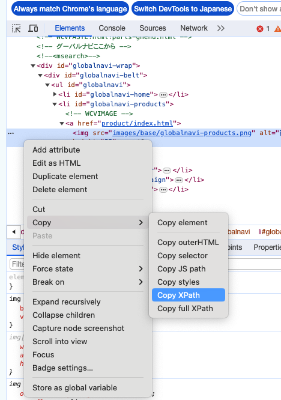

# hiroya-test
ブラウザ操作をpython seleniumを使って実行し、エビデンス生成までを自動化してくれるツール

# 1. 初期構築

1. git clone

    ```
	git clone https://github.com/hiroyalab/hiroya-test.git
	```

1. pythonのvenvを構築

	バージョン`python >= 3.9`

	vscodeなりで.venvを作成

	コマンドでやるなら、プロジェクトルートに移動して以下
	```
	python -m venv .venv
	```

1. pip install

	```
	source .venv/bin/activate
	pip install -r requirements.txt
	```
	※macでやった場合、ibm_dbのインストールに失敗する
	
	M1チップだとアーキテクチャが違うから

    [mac M1でibm_db install error](https://github.com/ibmdb/python-ibmdb/issues/835#issuecomment-1503772903)


# 2. テスト実装方法

1. testモジュール作成

	`tests/`配下に`test_*.py`というネーミングルールでファイル作成

	・helperクラスをインポート
	```
	from hiroyap.helper import Helper
	```
	
	・class, function作成

	classは`Test*():`というネーミングルールで記述
	
	functionは`test_*(self, helper: Helper):`で記述（日本語もOK）
	```
	class TestIt01Class():
		def test_01_01_ホーム画面レイアウト確認(self, helper: Helper):
			...
	```

	・DB接続をする場合（まだoracleとdb2だけ）

	グローバル変数に接続情報を定義する
	```
	db_use = True
	db_type = 'db2' or 'oracle'
	username = 'username'
	userpwd = 'password'
	host = '127.0.0.1'
	port = 50000
	service_name = 'dbname'
	```
	DB接続しない場合は、`db_use`を定義しないか`False`に設定

1. テストコード実装

	基本的にselenium拡張機能の`Helper`を利用する
	
	| 機能 | 説明 |
	| ---- | ---- |
	| `get()` | 指定したURLをgetする。初回画面表示等に使う<br>method指定で条件付き待機が可能 |
	| `click()` | 要素をクリックする<br>method指定で条件付き待機が可能 |
	| `check()` | 要素(checkbox)のチェックボックスをON/OFFする<br>method指定で条件付き待機が可能 |
	| `set_val()` | 要素(input)に指定した値を設定する |
	| `upload()` | 要素(input file)にファイルをアップロードする |
	| `select()` | 要素(select)に指定した値(selectで選択できる値)を設定する |
	| `mouseover()` | 指定した要素に対してマウスオーバーする |
	| `close_window()` | 別タブや別画面が開いた際に、現在アクティブなウィンドウを閉じる |
	| `write_md()` | 記事ファイルにMarkdown形式で追記する |
	| `exe_db()` | 指定したsqlクエリを実行する |


	・要素Byの取得方法(XPATHの場合)

	ブラウザの開発者ツールから取得する

	開発者ツール → 要素を選択 → 右クリック → Copy → Copy XPath

	

	・method指定で条件付き待機

	[参考サイト](https://office54.net/python/scraping/selenium-wait-time)
	
	サンプル。画面(body)に"アップロードが完了しました。"が出るまで待機
	```
	helper.get(url, EC.text_to_be_present_in_element((By.TAG_NAME, "body"), "アップロードが完了しました。"), wait=30)
	```

1. Selenium IDEからエクスポート

	Chromeの拡張機能Selenium IDEで操作の録画が出来るので、

	それをPython pytestの形式でエクスポートすれば概ねのひな型は作ってくれる。

	あとはちょこっと修正すればOK


# 3. テスト実施

※あくまで、seleniumを動かすためにpytestを利用するだけなので、アサーション等は行わない

[pytestの使い方](https://note.com/npaka/n/n84de488ba011)

[pytestコマンドライン小ネタ](https://dev.classmethod.jp/articles/pytest-tips-cmd-options/)

・全テスト実行
```
pytet -s tests
  -s：print文を出力させる
```
・モジュール指定実行
```
pytest -s tests/test_mod.py
```
・クラス指定実行
```
pytest -s tests/test_mod.py::TestClass
```
・ファンクション指定実行
```
pytest -s tests/test_mod.py::TestClass::test_func
pytest -s tests/test_mod.py::test_func
```

# 4. コンテンツ作成
 - ローカルで確認する場合
	```
	pelican content
	pelican --listen
	http://127.0.0.1:8000
	```

 - ホスティングサービスにあげる場合

	`publishconf.py`の`SITE_URL`を編集する
	```
	# If your site is available via HTTPS, make sure SITEURL begins with https://
	SITEURL = "http://domain.com/"
	```
	公開用のコンテンツ作成を行う
	```
	pelican content -o output -s .\publishconf.py
	```
	makeがインストールされてる場合
	```
	make publish
	```

	- S3にあげる場合
		
		aws cliを用いて入れる。

		[install aws cli](https://docs.aws.amazon.com/ja_jp/cli/latest/userguide/getting-started-install.html)
		```
		aws s3 sync output s3://{mybucket} --acl public-read --delete
		```

	- giuhub pagesにあげる場合

		github pagesは別のリポジトリにしなきゃいけないので、新規リポジトリを作成してクローン

		※無償版だとpublicじゃないとgithub pages使えないので注意
		```
		git clone https://github.com/hiroyalab/githubpages-test.git
		```
		ついでにpipでghp-importも入れておく
		```
		pip install ghp-import
		```
		
		`output`を新規リポジトリにコピーしてから、github pagesのプッシュ
		```
		ghp-import output
		git push https://github.com/hiroyalab/githubpages-test.git gh-pages:master
		```
		`ghp-import output`をやると`gh-pages`っていうローカルブランチが作成されて
		
		pushで`gh-pages`をリモートブランチの`master`にプッシュって感じ
		
		で、github pagesのブランチを`master`に設定すればOK

	- 静的ファイルとして提供する場合

		`publishconf.py`の`SITE_URL`を空文字で編集する
		```
		# If your site is available via HTTPS, make sure SITEURL begins with https://
		SITEURL = ""
		```
		で公開したら`output`ディレクトリ一式が成果物となる

		`output/index.html`を開けば見れる
